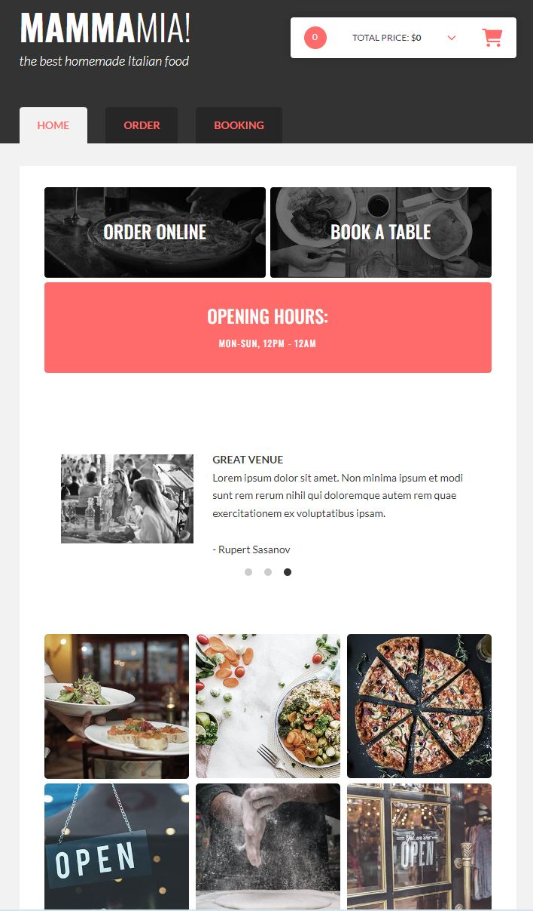
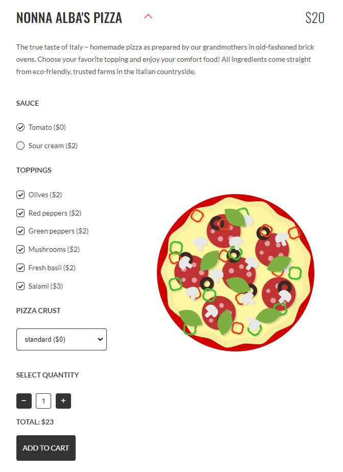
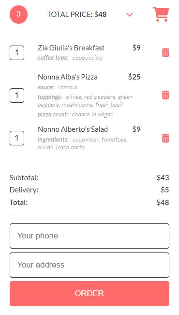
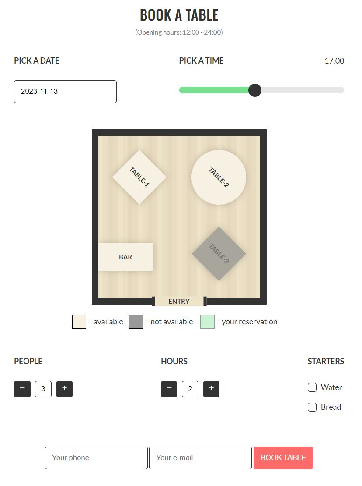
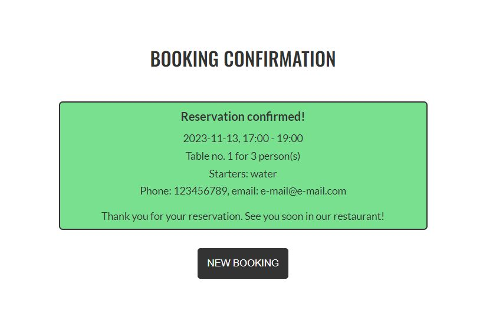

# Pizzeria

The Mamma Mia Restaurant/Pizzeria website not only presents its offerings but also allows clients to place orders and reserve tables online.

## [Demo (click)](https://pizzeria--bpedryc83.repl.co/)

## Technologies

- HTML
- CSS/SCSS
- Vanilla JS
- Handlebars
- AJAX/API

The initial design was provided and later developed by the author, Bartłomiej Pedryc. The majority of the logic has been personally implemented by the author.

## Overview

* Home 
  * Welcome page designed to visually encourage customers to explore the restaurant's offerings. In addition to SCSS styles, an external carousel script has been used for enhanced visual appeal.
  &nbsp;
* Order
  * On this subpage, the client can select from currently available products in the offer. Visualizations of selected ingredients for a certain product in the restaurant's menu is achieved through dynamic adding/removing SCSS style classes. Rendering information for each product is based on fetching data using AJAX/API. Handlebars technology has also been applied in this context.
  * The cart, although is not a part of the order subpage, is closely connected with its functionality. The display of its contents is also enhanced through Handlebars technology.
  &nbsp;
* Booking
  * Using a few widgets, the client can book an indicated table in the restaurant. What is important, this process is only possible when all other reservations are not in collision with the new one.    

## Screenshots

## Home page
  
  
## Order  
  
  
## Cart
  
  
## Booking page  
  
  
## Booking confirmation  
  
